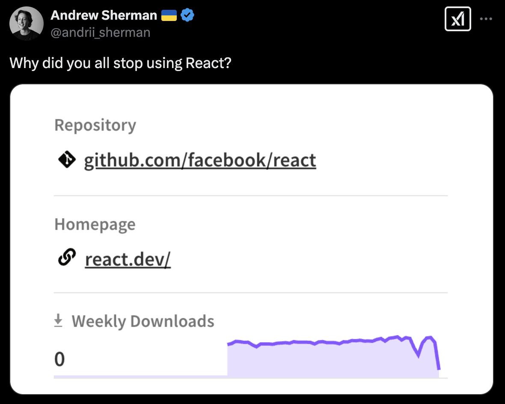

# React Meetup 13 February

- Website: [phx.js.org](https://phx.js.org)

### Upcoming Events

- 14-15 Feb (Fri) [CactusCon](https://www.cactuscon.com/)
- [Cowork with Friends](https://coworkwithfriends.com/groups/)

### What's going on in JS?

- [State of React 2024](https://2024.stateofreact.com/en-US/)
  - [Main APIS Pain Points](https://2024.stateofreact.com/en-US/features/)
  - Hooks Pain Points
  - [Libraries retention vs use](https://2024.stateofreact.com/en-US/libraries/)
  - [Meta-Frameworks](https://2024.stateofreact.com/en-US/libraries/back-end-infrastructure/)
  - Vite has now overtaken Webpack?
- [nodejs runtime support for Next.js Middleware](https://github.com/vercel/next.js/pull/75624)
- [bolt-expo](https://bolt.new/~/bolt-expo)
- [jsr open governance board](https://deno.com/blog/jsr-open-governance-board)
- [Add Astro as a framework option in react docs](https://github.com/reactjs/react.dev/issues/7477)

### My Picks

- [new npm fee](https://x.com/Steve8708/status/1886228651538264250)
